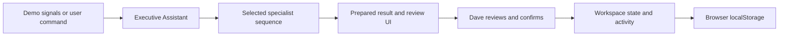

# Orbit — Executive and Personal Assistant

A portfolio demo for Dave: Orbit observes fictional workspace signals, prioritizes decisions, prepares work, and waits for explicit confirmation before executing a simulation. The existing premium dark UI, navigation, cards, review dialogs, command center, and orchestration network are retained.

**HTML, CSS, vanilla JavaScript, and inline SVG only. No real AI model, external libraries, account connections, API calls, or real messages.**


## Product version and roadmap

**Current Version:** `1.5.0` — v1.5 Collapsible Navigation (Completed)  
**Current release:** `v1.5 — Collapsible Navigation`  
**Current major product phase:** `V1 — Portfolio Prototype`  
**Completed capability baseline:** v1.0–v1.5  
**Planned Next Version:** `v2.0 — Hosted Web App`

`VERSION` is the release identifier; `CHANGELOG.md` records completed work and development scope. V1.5 acceptance checks passed for this fictional browser prototype; the project remains in V1, not V2.

Orbit is an **interactive prototype** demonstrating simulated agent orchestration and human-in-the-loop workflows. The current project is not a production application or a connected assistant. A hosted preview or deployment experiment does not change that classification.

| Version | Name | Status | Primary Goal |
|--------|------|--------|--------------|
| v1.x | Portfolio Prototype | Current major phase | Demonstrate Orbit UX and assistant behavior |
| v2.0 | Hosted Web App | Planned | Make Orbit a real hosted application |
| v3.0 | Connected AI Assistant | Future | Add real email/calendar/task/AI integrations |
| v4.0 | Installable App | Future | Add PWA/desktop/mobile installation experience |

### Feature releases within V1

These are capability milestones reconstructed from the current implementation, not dated Git tags or a claim about the chronological order in which features were built.

| Release | Name | Status | Purpose |
| --- | --- | --- | --- |
| v1.0 | Initial Portfolio Prototype | Completed | Establish the visual product concept and core simulated assistant experience |
| v1.1 | Proactive Assistant Experience | Completed | Move Orbit from a passive dashboard toward a proactive executive assistant |
| v1.2 | Contextual Approvals and Action Workflows | Completed | Turn generic approvals into meaningful human-in-the-loop actions |
| v1.3 | Interactive Inbox and Orbit Drafts | Completed (`1.3.0`) | Make Priority Inbox an actionable communication workspace |
| v1.4 | Document Sharing & Delivery Context | Completed (`1.4.0`) | Make document delivery, access, and confirmation explicit |
| v1.5 | Collapsible Navigation | Completed (`1.5.0`) | Offer full, compact, hidden, and mobile drawer navigation |

**v1.0 includes:** Orbit branding, premium dashboard UI, Personal and Work workspaces, AI Operations visualization, simulated specialist agents, command center, fictional inbox/calendar/tasks, approval section, localStorage, Reset Demo, and responsive layout.

**v1.1 includes:** executive briefing, Since Your Last Check, Needs Your Attention, Orbit Already Handled, recommendations, interruption prioritization, proactive simulated events, assistant-led copy, reduced dashboard emphasis, and proactive workspace monitoring simulation.

**v1.2 includes:** Send Email, Approve & Reschedule, Share Document, contextual local task actions, editable review flows, simulated execution confirmations, activity updates, and persistent approval state. Local task actions currently mean completion/reopening, not an external task-platform connection.

**v1.3 includes:** full-message details, reply composer, Orbit-prepared/editable drafts, Save Draft, simulated Send Reply, Mark Handled, contextual Add to Calendar/Create Reminder/Snooze/Create Task/Add Follow-up actions, synchronization with Needs Your Attention, and workspace-specific message-state persistence. Approval-modal email editing remains supported through the shared underlying reply state; a pending email review now opens its underlying message/composer. No real delivery or account integration is introduced.

**v1.4 includes:** document filename/title/type/source, fictional recipient names and addresses, delivery/access selectors, editable accompanying message, Save Draft, live final summary, explicit simulated Share Document, and compact recorded history. This requested V1 extension adds no providers or V2 infrastructure.

**v1.5 includes:** expanded/compact/hidden desktop navigation, hover/focus icon tooltips, a persistent independent layout preference, a sticky restore control, and a native mobile drawer with keyboard/outside/destination dismissal.

See [CHANGELOG.md](CHANGELOG.md) for release scope and simulation boundaries.

### v1 — Portfolio Prototype

**Status: Current version.** Demonstrate the product concept, user experience, assistant behavior, orchestration model, and human-in-the-loop workflows using fictional data.

The V1 scope includes:

- Premium executive assistant UI and Orbit assistant experience.
- Personal Workspace and Work Workspace.
- Proactive executive briefing, Since your last check, Needs your attention, Orbit already handled, and recommendations.
- Command center with simulated natural-language intent routing.
- AI Operations orchestration visual with Inbox Agent, Calendar Agent, Task Agent, Research Agent, and Approval Agent.
- Simulated proactive events and contextual Send Email, Approve & Reschedule, Share Document, and local task updates.
- Activity feed, browser localStorage persistence, Reset Demo, responsive design, and accessibility features.
- Fictional/demo data only.

V1 does **not** include real Gmail, Outlook, Google Calendar, Microsoft Graph, or LLM/API integrations; real background monitoring; real email sending, meeting rescheduling, or document sharing; production authentication; a cloud database; or a production backend. These are future work, not current capabilities. Accessibility support is implemented, but no formal accessibility audit is claimed.

**V1 completion gate before beginning V2:** finish the product experience; verify both workspace flows, commands, selective triage, orchestration, review/edit/confirm actions, persistence, and Reset Demo; resolve known blocking defects; validate responsive and keyboard behavior; and keep documentation and portfolio screenshots accurate about simulations. Existing validation is recorded in `QA.md`; it does not establish production readiness or certification.

### v2 — Hosted Web App

**Status: Planned next version.** Turn the prototype into a real hosted application accessible from a public URL while preserving the user experience.

V2 should introduce:

- Public hosted URL and repeatable production-style application deployment.
- Real application routing and environment configuration.
- Backend/API foundation and persistent server-side storage beyond browser localStorage.
- User authentication if appropriate, with secure session handling for authenticated flows.
- Production logging, basic audit history, and health/error handling.
- Deployment documentation and separate development, demo, and production environments.

Assistant integrations may remain simulated. **Real Gmail, Calendar, or AI integrations are not required for V2.** The milestone is a real web application, not yet a fully connected assistant.

**V2 acceptance gate:** the application is deployed at a usable public URL, its routing and backend/storage work end-to-end, environment separation and deployment instructions are reproducible, and applicable authentication/session, logging, audit, and failure-handling flows are validated. A static upload or deployment experiment alone is insufficient.

### v3 — Connected AI Assistant

**Status: Future version.** Replace simulated integrations with real user-authorized services and real assistant actions.

Possible V3 scope includes:

- Gmail, Outlook, Google Calendar, Microsoft Graph, real task platforms, and a real LLM API.
- Authenticated user connections, OAuth, scoped permissions, and permission management.
- Real inbox, calendar, and task monitoring through proactive background jobs or event-driven triggers.
- Real notifications and draft generation.
- Real email sending, meeting rescheduling, and document sharing **after explicit approval**.
- Audit trail, retry/failure handling, and connection health.

These are planned capabilities, not installed connections. Human-in-the-loop approval must remain for consequential actions: Orbit prepares the work, Dave reviews/edits it, and Dave explicitly confirms execution.

**V3 acceptance gate:** at least one real external integration works end-to-end with authentication, scoped authorization, and approved actions, with auditable outcomes and tested failures. Document exactly which providers are connected; one working integration does not imply every listed provider exists.

### v4 — Installable App

**Status: Future version.** Make Orbit installable and more persistent across devices.

Preferred path:

1. Progressive Web App (PWA).
2. Desktop wrapper if useful.
3. Mobile-specific experience if justified.

Possible features include an installable PWA, desktop notifications, background sync where supported, an offline shell, a Tauri or Electron desktop wrapper if needed, OS-level shortcuts, native-style notifications, tray/menu-bar presence if implemented, and a mobile-responsive assistant experience. V1 already has a responsive browser layout; installation, native presence, background sync, and device-aware persistence are not implemented today.

**V4 acceptance gate:** the application can actually be installed and launched as a PWA or desktop/mobile app, and the supported installation, update, and device-specific behavior is verified. A manifest draft or mobile screenshot alone is insufficient.

## Release versioning and future implementation prompts

Use semantic-style milestone versioning:

- Minor V1 feature releases: v1.1, v1.2, v1.3, and so on; release identifiers use three components, such as `1.3.0`.
- Bugfix-only release: v1.3.1 after the corresponding stable feature release; unfinished releases retain a `-dev` suffix.
- Next major product milestone: v2.0 (`2.0.0`) only when the hosted-app acceptance gate is met.

A feature addition alone never advances the project to V2. V3 requires at least one real external service authenticated and working end-to-end, including approved actions. V4 requires genuine installation. Development identifiers may identify planned scope, but do not imply completion. Do not bump a release number unless the requested work is actually completed and tested.

Every future implementation prompt should include:

```text
Target release:
vX.Y

Release goal:
Short description
```

Codex should update `CHANGELOG.md` to describe actual changes and validation, `VERSION` when a release change is appropriate, and README roadmap status when a milestone changes. Keep pending work clearly separated from delivered features. The v1.5 completion gate has been validated and `VERSION` is now `1.5.0`; use a development suffix again for a future unfinished release. Do not invent release dates, Git tags, or completed integrations.

## V1 Locked

**Release decision: READY FOR V2.** Current release: `1.5.0` — v1.5 Collapsible Navigation. The V1 portfolio experience is complete within its documented fictional, browser-only scope.

The release-readiness audit covered both `index.html` and the generated `preview.html`, Personal/Work isolation, all required commands and exact specialist sequences, contextual actions, interactive inbox, boundary-case persistence, Reset Demo, desktop/tablet/mobile layouts, keyboard/focus/reduced-motion basics, console/resource checks, and documentation. Release-blocking defects found during the audit were fixed and retested; evidence and limits are in [QA.md](QA.md).

The explicitly requested v1.4/v1.5 refinements extended the earlier V1 lock for document-sharing context and optional navigation. Their acceptance tests passed and the updated V1 baseline is locked again. Future feature development should target **`v2.0 — Hosted Web App`**. V1 is reserved for necessary maintenance fixes. Do not relabel the product V2 until its hosted-application acceptance gate is met. No V2 implementation, real integration, or production infrastructure was added during this audit. This lock is not a published Git tag, deployment, cross-browser certification, or formal accessibility audit.

## What is real today

The following are working browser features:

- Interactive UI, workspace switching, responsive layout, and keyboard/reduced-motion support.
- Deterministic simulated command routing and animated simulated agent orchestration.
- Proactive briefing/triage logic, interactive inbox details, actual editable local Orbit drafts, and saved reply history.
- Contextual approval workflows with editable drafts, time changes, explicit confirmation, and visible local results.
- Local task completion/reopening, activity history, counters, and workspace-specific state.
- Browser localStorage persistence, session fallback when storage is blocked, and Reset Demo.
- Local timers, pause/resume controls, and timeline updates that drive the fictional scenario.

These interactions genuinely work; their underlying data and external outcomes remain simulated. Browser timers do not provide a persistent background service, server-side monitoring, or observation of real accounts.

## What is simulated today

- Incoming email and calendar events: predefined fictional fixtures/signals.
- Task monitoring and background monitoring: local checks of the demo scenario while the page is available.
- AI agent reasoning and natural-language interpretation: deterministic JavaScript routing, triage rules, and prepared responses; no LLM.
- Research and draft generation: local fictional notes and prepared text, not web research or generated model output.
- Email sending, meeting rescheduling, attendee notification, and document sharing: local state transitions and demo confirmations; no external execution.

No real Gmail, Outlook, Google Calendar, Microsoft Graph, task platform, or AI API is connected. OAuth/account authorization is not implemented; there are no real notifications or external API calls. There is no production authentication, cloud database, or production backend. A successful demo confirmation records a simulation only.

## Roadmap principle and version change rule

**“Each version should be considered complete before the next version begins.”**

The sequence is:

1. **V1:** Finish product experience.
2. **V2:** Deploy and add application infrastructure.
3. **V3:** Connect real services.
4. **V4:** Make the product installable and device-aware.

Future integrations must not creep into V1 unless explicitly requested. Record planned Gmail integration and planned hosted application architecture as future work. Use credible portfolio language such as “interactive prototype,” “simulated agent orchestration,” and “human-in-the-loop workflow”; do not describe simulations as live integrations or claim production readiness.

Advance the product version only when that version's acceptance criteria are actually met and supported by validation evidence. Do not call the project V2 merely because a deployment experiment exists, V3 before an authenticated external integration and approved actions work end-to-end, or V4 before actual installation works. Internal asset cache tags and persisted state schema versions are implementation details, not product roadmap versions.

## Assistant-led experience

The page follows this hierarchy:
1. Greeting and command input, with contextual actions on completed responses.
2. Executive briefing with one consistent top priority and next action.
3. Expandable “Since your last check” supporting context.
4. Needs your attention: pending decisions and due-today tasks.
5. Expandable preparation facts and recommendations.
6. Collapsed supporting metrics, then detailed inbox, calendar, task, and research panels.
7. AI Operations and Activity & decision history.

Supporting summaries remain available without repeating their full content on every visit. Demo options in the header contain Reset demo and Motion controls.

Only urgent tasks and explicit decisions enter the attention queue. Focus time, meeting briefs, future tasks, and lower-priority messages are informational and stay out of it. The current fictional day has no overlapping events today and no overdue baseline tasks; declining or deferring Friday’s proposed change does not resolve the original conflict. Reassurance is limited to those supported facts.

## Triage policy

One policy drives the briefing, Needs your attention, and the next recommendation:
- High-priority tasks due today rank first, followed by other due-today work.
- The Personal family reply is urgent because the answer is needed tonight.
- Work’s reply before Friday, the proposed Friday reschedule, and document sharing are prepared decisions, with lower urgency.
- Completed work leaves the queue and moves to decision history.
- Low-priority messages and informational preparation never create decision cards.

Personal’s pending lunch reply represents the related follow-up task once, rather than asking Dave to confirm the same work twice. Explicitly choosing Send Email also marks that linked local demo task complete and records why. Manually completing/reopening tasks still works. Work’s partnership reply has no linked task.

Personal initially has four distinct attention items; Work has five. Approval counts remain three in each workspace because task actions are counted separately.

## AI orchestration architecture

Orbit runs entirely in the browser. Deterministic intent routing selects an ordered specialist sequence. A shared workflow scheduler activates the Executive Assistant, highlights the current specialist/path, records timeline stages, and returns the prepared result. Fictional proactive signals use the same orchestration layer. Generation guards cancel superseded work on interruption, workspace switch, and Reset.

The active workspace state drives briefing, attention, recommendations, inbox, task/approval counts, and activity. Review/composer controls prepare local payloads; Dave explicitly confirms execution before state is committed. Personal and Work have independent records inside one browser storage envelope. Agent cards show processing state and do not navigate. No specialist calls a model, external service, or backend.



## Proactive demo monitoring

The behavior loop is visible in the execution timeline:

Observe → Understand → Prioritize → Prepare → Escalate only when needed → Act after Dave’s confirmation → Confirm completion.

Monitoring is on by default. An initial signal starts after about 1.5 seconds. Six scenario signals are processed once per workspace:

| Signal | Specialist sequence | Preparation / triage |
| --- | --- | --- |
| Important email | Inbox → Approval | Prioritize and summarize the fictional message; retain the prepared reply |
| Scheduling conflict | Calendar → Approval | Check overlap and prepare a clean alternative; never execute it automatically |
| Approaching deadline | Task | Flag a remaining due-today task; suppress escalation if Dave already completed it |
| Meeting brief | Calendar → Research | Prepare an expandable calendar brief from local notes; informational |
| Draft response | Inbox → Approval | Check the draft; preserve Dave’s saved edits and any recorded send |
| Approval ready | Approval | Surface pending specific decisions; do not reopen completed actions |

Specialist stages last roughly 0.65 seconds, with a short preparation phase. Subsequent initial signals start about 1.6 seconds after the previous completion. Once all six have been triaged, quiet 45-second checks continue without manufacturing more arrivals or duplicating history. Next demo signal advances the remaining scenario, or replays a known signal after the sequence is complete. Replay position is separate per workspace. Pause/Resume demo monitoring controls automatic work; a manual signal is still available while paused.

Commands preempt background preparation. Opening a review pauses it; hidden tabs suspend it. Switching workspaces or Reset cancels pending timers and invalidates old callbacks, preventing results from crossing contexts. Completed stages/events persist; partially processed signals can be checked again. Proactive work does not overwrite a command response or take keyboard focus. Informational work uses quiet status updates; urgent results can announce that attention is needed.

This is a bounded, fictional event scenario, not account polling or a real “since your last visit” detector. Static dates and fixtures do not update from the real world.

## Workspaces

The header retains Personal Workspace / Work Workspace with Dave, D, and the Executive workspace secondary label, accessible with expanded, compact, hidden, or mobile navigation. Selection is saved locally. Both contexts share the visual design but have independent tasks, approvals, drafts, activity, monitoring preferences, signal progress, replay position, and meeting-brief preparation.

- **Personal:** 8 unread demo messages, 3 personal events, 6 household tasks; family lunch, appointments, errands, and a bill reminder. Prepared actions are a lunch reply, maintenance reschedule, and family plan share.
- **Work:** 12 unread demo messages, 4 meetings, 6 project tasks; partnership, leadership, project deadlines, and team decisions. Prepared actions are a partnership reply, investor reschedule, and executive digest share.

The fixed scenario is Wednesday, October 7, 2026, Eastern time. Friday’s Personal conflict is an appointment versus maintenance; Work’s is an investor call versus Finance. The inbox, schedule, research, briefing, commands, and agent metrics use only the active context.

## Contextual execution

| Type | Review | Explicit execution | Result |
| --- | --- | --- | --- |
| Email | To, subject, editable body, rationale; Cancel / Save Draft | Send Email | Sent |
| Calendar | Original/proposed times, attendees, overlap, reason, notification choice; Edit Time | Approve & Reschedule | Rescheduled |
| Document | Filename/title/type/source, recipients, delivery/access, preview, editable message, live summary; Save Draft | Share Document | Shared |
| Local task | Open the specific existing task | Check/uncheck task | Complete / reopened |

Opening Review or an action button never executes anything. Save Draft retains edits without reducing approval counts. Cancel discards unsaved edits. Calendar validation rejects invalid ranges and the current workspace’s flagged overlap. Execution saves the exact payload, changes counts and briefing, records activity, and prevents duplicates. Completed cards remain reviewable under Activity & decision history; they cannot be executed again. All outcomes and attendee notifications are explicitly simulated. Pending email reviews now open the underlying message and composer; recorded sends remain reviewable in decision history.

## Priority inbox — communication workspace

**Needs your attention** is Orbit’s concise prioritized action summary. **Priority inbox** contains the actual fictional messages and communication actions. Reviewing the primary email decision opens the same message/composer as the inbox, rather than a duplicate approval workflow.

Open a message by clicking its row or activating its native Open Message button with the mouse, Enter, or Space. Message groups contain semantic action buttons rather than nested button roles. Details include sender, received time, full body, priority, message state, Orbit summary, recommendation, and contextual controls. Escape dismisses dialogs, a shared focus-containment helper keeps Tab/Shift+Tab inside, and closing returns focus to the originating control or message. Enter in reply metadata fields does not execute Send Reply.

- Family and work correspondence: Review Orbit Draft, Edit Draft after saving, Write my own reply, Save Draft, Send Reply, and Mark Handled.
- Appointment reminder: Add to Calendar, Create Reminder, and Mark Handled.
- Bill reminder: Create Reminder, Snooze, and Mark Handled. Mark Handled does not pay anything. Return to inbox restores a snoozed message.
- Family scheduling: Add to Calendar in addition to correspondence controls.
- Work messages: Create Task and Add Follow-up in addition to correspondence controls.

Orbit drafts are actual editable local text. Review Orbit Draft fills the prepared text; Write my own reply offers a blank composer when no saved draft exists. Saved edits take precedence over prepared text. Both reply workflows use a shared 10,000-character limit; exact confirmed recipient, subject, and body survive refresh. Cancel or closing discards unsaved edits but retains a saved draft. Explicit Send Reply records the exact body, marks Replied, updates unread/priority counts, activity, attention, and briefing, and displays “Demo simulation — no real email sent.” No agent automatically sends it.

The primary send shares the existing email approval execution and prevents duplicate sends; Personal also completes the linked lunch follow-up task. Mark Handled resolves the local primary decision without inventing a Sent execution. Snooze requires a future browser-local return time. Orbit restores the message when open at or after that time, including after refresh. No external delivery or notification job runs.

Supported states: New, Important, Draft Ready, Draft Saved, Replied, Handled, Snoozed, and Reminder Created. Read flags are tracked independently. Counts reflect changes within the four visible messages plus the fixture’s other unread messages; they are not a live mailbox query.

Local artifacts remain visible beneath the inbox, and appear in calendar or tasks as appropriate. Created work tasks/follow-ups update open-task counts and can be completed/reopened. Reminders are separate local records, not scheduled notifications. Calendar additions retain the fictional Friday/Saturday date and do not inflate today’s meeting count. Duplicate creation of the same action for a message is prevented. All of this state and activity persists separately per workspace; Reset Demo clears both.

### V1.3 acceptance walkthrough

1. Select Personal Workspace and pause demo monitoring for a steady test.
2. Open Alex Rivera’s message → Review Orbit Draft → edit the body → Save Draft.
3. Close, refresh, reopen, and choose Edit Draft. Confirm your text is retained.
4. Click Send Reply. Confirm Replied, two pending approvals, five remaining original tasks, removal of the lunch decision, activity, and the explicit simulation confirmation.
5. Open the appointment message. Create Reminder and Add to Calendar; inspect the local artifacts in Tasks/Calendar. Repeat an action to confirm duplicate prevention.
6. Open the bill message and Mark Handled. Refresh and verify reply, reminder/calendar, and handled state survive.
7. Switch to Work. Confirm Sarah is untouched; create a task/follow-up and complete one. Switch repeatedly and refresh to verify independent counts and history.
8. Reset Demo and inspect both workspaces. Original messages, six tasks, three approvals, and initial statuses return; local artifacts disappear.
9. Also test blank replies, Cancel, reversible Snooze, keyboard/Escape, mobile widths, blocked storage, existing calendar/document approvals, commands, and proactive signals. Validation evidence is recorded in `QA.md`.

## Contextual document sharing — V1.4

The attention card shows Orbit’s preparation, intended recipients, delivery, and access level. **Review & Share** or **Review** opens the full context; opening a review never executes an action. Personal uses `Family_Weekend_Plan.pdf` for Alex Rivera and Jamie Chen; Work uses `Weekly_Executive_Digest.pdf` for Morgan Ellis and Daniel Kim. Recipients have reserved fictional `.example` addresses and are reviewable, not editable in this release.

The panel shows the document title, PDF type, **Orbit Demo Drive** source, recipient names/addresses, preview, and why Orbit prepared the share. These are fictional document templates and local text; no real PDF is generated or uploaded, and no cloud provider is connected.

| Delivery option | Demo meaning |
| --- | --- |
| Email with cloud link (default) | Record a proposed email/link delivery; no real link or email |
| Email attachment | Record proposed PDF attachment delivery; no actual attachment sent |
| Copy share link | Record a simulated copy-link action; no link generated, clipboard update, or recipient email |

Access choices are **View only** (default), **Can comment**, and **Can edit**. They record intended demo access, not provider permissions. The attachment option explains that an attachment cannot enforce cloud access restrictions. Copy-link mode explains that its accompanying message and recipient list are context, not delivered mail.

Edit the accompanying message directly. The live **What / Who / How / Access / Message** summary reflects the current selections. **Save Draft** persists the whole prepared payload without resolving attention or reducing counts. Cancel/closing discards unsaved changes and retains any saved draft. Repeated identical saves do not duplicate activity.

Only an explicit **Share Document** confirmation records Shared. It saves recipients, delivery, access, message and document metadata; removes the attention item; updates counts, briefing, and activity; and confirms **“Document shared — demo simulation”** plus **“No real cloud link or email was sent.”** Completed cards and read-only reviews show compact timestamp/recipient/delivery/access history. Duplicate execution is disabled.

State is separate per workspace and survives refresh. Reset Demo clears both share drafts/executions and restores the original recipients, cloud-link delivery, view-only access, and prepared messages. Blocked storage supports the current session with feedback.

Earlier message-only share records remain reviewable. Recipient addresses, delivery, and access that were not recorded are labeled unknown; current template defaults are not presented as confirmed history. Older unexecuted message drafts receive editable current-context suggestions and record the full context only when saved/confirmed.

### Test the share flow

1. Personal → document card → Review & Share. Inspect `Family_Weekend_Plan.pdf`, recipients, source, and Orbit’s reason.
2. Change delivery/access, edit the message, and inspect the live summary.
3. Save Draft, close, refresh, and reopen. Confirm selections/text persist and approval count remains three.
4. Share Document. Confirm Shared, count three→two, removal from attention, activity, simulation confirmation, and completed-action history.
5. Refresh, inspect recorded details, and verify execution controls are disabled.
6. Switch to Work; verify its digest, recipients and independent defaults/state. Reset Demo and inspect both contexts.

### Future V3 cloud integrations

Planned providers may include **Google Drive**, **OneDrive / SharePoint**, **Gmail**, and **Outlook / Microsoft Graph**. A future authorized flow can locate or prepare the document, plan a cloud link and scoped permissions, prepare email, request Dave’s approval, then apply permissions and deliver after confirmation, with outcome/audit/failure handling. V1.4 implements none of those provider operations. Hosting and server-side infrastructure remain the separate v2.0 milestone.

## Commands

| Request | Route |
| --- | --- |
| What changed? | Inbox → Calendar → Task → Approval |
| What needs my attention? | Same sequence, then ordered actionable decisions |
| What did you handle? | Executive Assistant; current preparation facts |
| What can you handle for me? | Executive Assistant; capabilities and simulation boundary |
| Review my inbox | Inbox |
| Check my schedule | Calendar |
| What tasks are due? | Task |
| What needs my approval? | Approval |
| Research this project | Research; local fictional notes only |
| Give me a briefing | Inbox → Calendar → Task → Approval |

Suggestions submit immediately. Unknown requests explain supported capabilities. Routing is deterministic keyword/phrase logic; ambiguous multi-domain requests become a combined briefing. Commands never execute email, schedule, sharing, or external-record changes.

## Collapsible navigation — V1.5

The sticky top-left header button cycles **Expanded → Compact → Hidden → Expanded** on desktop and tablet. Expanded retains the Orbit logo, full labels, and status/profile area. Workspace switching stays available in the persistent header in every navigation mode. Compact uses a 76px icon rail, clear active highlighting, and visual labels on hover or focus. Hidden removes sidebar space and keyboard access to the hidden controls; the header’s **Show navigation** button always remains reachable. Main content gains the released width, subject to the existing reading-width limit.

Desktop preference is saved independently in `orbitSidebarState` with values `expanded`, `compact`, or `hidden`. It survives refresh, workspace changes, and Reset Demo. A new profile defaults to expanded; invalid values fall back safely. Blocked storage keeps the chosen layout for the current session with feedback. This preference does not change fictional workspace data.

At **650px and below**, the same header control opens a mobile drawer instead of cycling desktop states. The drawer contains full labels and Orbit status; the header workspace switcher remains available when the drawer is closed. Selecting a destination, tapping the backdrop, using the close button, or pressing Escape closes it. Background content is inert through the native modal dialog. Tab/Shift+Tab stay inside; closing returns focus to the opener. Reload starts with the mobile drawer closed, and resizing back to desktop restores the saved desktop state.

Controls are semantic buttons/links with action-specific labels, aria-expanded, and a named drawer. Compact links retain accessible names while their visible text fades; tooltips appear on hover/focus. Hash navigation from content links also synchronizes active highlighting. The sticky header and adjusted anchor spacing keep restoration and destination headings usable when scrolled. Width/content and drawer transitions are restrained; reduced-motion and Motion off disable visual transitions. Browsers without discrete-dialog transition support retain functional immediate dismissal.

### Navigation verification

1. At desktop width, cycle all three states; navigate in compact mode and inspect hover/focus labels.
2. Refresh each preferred state, then switch workspaces and Reset Demo. The preference must remain independent.
3. In hidden mode, use a content-section link and restore navigation. Confirm the active destination is highlighted and the restore control stays visible.
4. Resize through 1440/1024/768/390/320px. At mobile width, open the drawer, navigate, switch workspaces, press Escape, and tap outside.
5. Test both directions of Tab, focus return, reduced motion, and resize while the drawer is open. Return to desktop and verify the prior preference.

## Files and preview

- `index.html`, `styles.css`, `app.js`: canonical interface, visual layer, and interaction/state logic.
- `preview.html`: generated self-contained version for environment file previews.
- `build_preview.py`: standard-library bundler; only reads/writes inside this folder.
- `README.md`, `CHANGELOG.md`, and `VERSION`: product roadmap, release history/development scope, and current release identifier.
- `QA.md` and `screenshots/`: validation evidence and portfolio captures.

From the repository root:

```bash
cd ai/executive-assistant-dashboard
python3 -m http.server 8000 --bind 0.0.0.0
```

On your own machine, visit `http://localhost:8000/index.html`. In a hosted environment, use its port-8000 preview or open `preview.html` in its file viewer. The app cannot create a public hosted URL itself. A viewer that blocks JavaScript cannot run interactions; blocked storage falls back to session state.

Regenerate the bundled preview after edits:

```bash
python3 build_preview.py
```

## Persistence and Reset

`orbit.executive-assistant.workspaces.v1` stores selected context and two additive v2 state models. Each preserves exact executions, email and document share drafts, completed tasks, bounded activity (newest 100 events), motion preference, `monitoringSeen`, `monitoringReplay`, `monitoringPaused`, and `meetingBriefPrepared`, and additive `messages` state (read flags, statuses, drafts, exact sent bodies, local calendar/reminder/task/follow-up artifacts and completion). Temporary processing and command responses are not saved. Refresh does not resume a half-completed external action or duplicate completed signals.

Earlier business state from `orbit.executive-assistant.demo.v2` or `orbit.executive-assistant.approvals.v1` migrates exclusively into Work. Prior generic approval history remains a review, not an invented Sent/Rescheduled/Shared result. Existing edited details and completed tasks remain intact.

Reset restores both datasets, clears message states and local message artifacts, draft edits, executions, task completion, activity, monitoring progress/replay/preferences, and restarts the active workspace’s demo monitoring. It preserves selected workspace and unrelated browser storage. Pause monitoring after Reset if you want a still screenshot. Storage is scoped to browser origin/profile; served index/preview share it, separate file-viewer origins may not. Cross-tab live synchronization is not implemented. Blocked/full storage retains usable session behavior with explicit feedback.

## Manual verification

1. Open the page and read the executive conclusion and next-action button without opening metrics or entering a command.
2. Wait about 20 seconds. Watch specialist activation and six proactive events; confirm approval/task counts do not change merely from preparation. Open the newly prepared calendar brief.
3. Pause monitoring, then try Next demo signal. Inspect the active paths/timeline; after completion use Show full timeline. Informational signals should not add action cards.
4. Run the four conversational questions in Personal and Work. Compare context, pending decisions, and preparation.
5. Review/edit/save/send one email, edit/reschedule one calendar action, and select delivery/access, edit/save/share one document. Confirm counts, history, current briefing, exact saved payloads, and disabled duplicate execution. Personal Send also completes the linked follow-up task.
6. Open the specific urgent task, complete/reopen it, and verify triage changes. Complete all due-today work and pending actions; the attention queue should show its quiet empty state.
7. Switch repeatedly and refresh. Results, drafts, monitoring progress/preferences, and history must stay separate. Switch/reset during preparation and verify no late cross-workspace event.
8. Test mobile menu, modal, collapsed metrics/history, keyboard focus, reduced motion, and blocked storage. Reset both contexts to restore the original scenario.

## Limitations and next phase

There is no real inference, live account observation, web research, backend, authentication, multi-user state, or real execution. LocalStorage is a browser-only demo store. Glass rendering depends on browser support; system fonts and translucent backgrounds remain usable. Chromium checks and screenshots are documented in QA; they are not a formal accessibility audit or a cross-browser certification.

Next milestone: implement V2 hosted application infrastructure while keeping integrations simulated. The V1 product-experience gate passed the release-readiness audit documented in `QA.md`. A read-only adapter for an explicitly connected provider belongs to V3, followed by approved write actions with the same review/edit/confirm boundary.

## CEO workflow refinement (V1 maintenance)

- Daily briefing and the overview share `attentionItems()` for the same first priority.
- Each pending card has one visible review entry. Explicit Send Reply, Approve & Reschedule, and Share Document remain inside review.
- Calendar/document reviews include Not needed and Defer. These local decisions reduce waiting counts without recording a send, reschedule, or share. A future return time is required for defer; expired items return when Orbit is open. Restore to attention is available in decision history. Edits retained with a deferred decision remain drafts.
- Created tasks/follow-ups require a title, owner, and due date; date-based tasks due on the fictional day participate in attention and counters. Reminders require a future time and are visible in Tasks. When due, an in-app activity entry is recorded once while Orbit is open; no push notification is sent. Created tasks/follow-ups and reminders can be edited without adding duplicates.
- Document preview/source/preparation details are expandable; recipients, delivery, access, message, and confirmation remain available. Final controls stay at the bottom of the review viewport.
- These fields persist independently in each workspace. Reset demo restores both contexts, including declined/deferred decisions and timed message state. Navigation layout remains independent.

## Full task-list review

“Open task” in Needs your attention, the executive briefing, or recommendations opens a native task-list dialog instead of scrolling to the task panel. The selected task is highlighted and focused; all six baseline tasks and any created tasks/follow-ups from the active workspace are included. All, Open, Due today, and Completed filters support quick review. Check/uncheck tasks to complete/reopen them; counts, attention, command responses, and browser persistence remain synchronized. “View full list” in On your radar and the task-command response open the same list. The sidebar still navigates to the Tasks section. Reminders remain separate local records in that section.

## Interactive meeting briefs

Each scheduled meeting has a keyboard-accessible View briefing button; clicking the meeting card opens the same native dialog. The panel includes the correct date/time and location, fictional attendees and agenda, Orbit preparation notes, related task/reply state, and a suggested focus. Personal and Work use separate local fixtures. Existing locally added calendar entries are also reviewable.

The Friday scheduling proposal has its own entry beneath today’s timeline. Its detail panel shows the original time, proposed or confirmed time, conflict, and pending/deferred/declined/rescheduled state. Review proposed change opens the existing explicit calendar approval flow. Cancel, defer, decline, and confirmed execution return to the meeting panel with the current state. Restore & review change explicitly restores a deferred/declined proposal without executing it. Confirmed changes are read-only in the approval record and persist across refresh. Background demo preparation pauses while meeting details are open.

All agendas, attendee lists, and preparation notes are fictional. No conferencing, live calendar, backend, or AI-model connection was added.


## Decision-ready CEO workflow — V1 maintenance

Command responses now contain compact, actionable cards rather than requiring a second trip to each dashboard section:

- **Review my inbox:** read a message, review/edit its prepared reply, mark it handled, or set/edit a fictional reminder. Supporting messages are collapsed. Where a related work task already exists, open that task instead of creating a duplicate.
- **What tasks are due?:** complete or reopen tasks directly, or open the full list. Past-due local tasks receive priority and are included consistently in attention, briefing, counters, and agent status.
- **Check my calendar:** open individual meeting briefs; review the separate proposed scheduling change through its existing explicit confirmation flow.
- **What needs my approval? / Daily briefing:** review the highest-priority prepared actions and handle due tasks directly. Completed, declined, and deferred decisions remain distinguishable; an empty attention queue does not claim deferred work was executed.

Mark handled offers immediate Undo. Handled or snoozed messages can also be reopened after refresh without resetting the demo. Reopening preserves saved drafts and later manual task decisions; it never unsends an email. A later local decision removes a stale immediate Undo control. The family invitation task tracks responding, rather than assuming Dave accepted the invitation.

Inline editors preserve unsaved fields during response updates and require Save or Cancel before a new command. Review dialogs return focus to the response. Workspace changes and Reset clear transient responses/editors; saved decisions, drafts, task metadata, and reminder times remain workspace-specific. Undo itself is temporary.

Typed commands do not execute actions or generate arbitrary replies. Requests such as “Send email” show the prepared review path and explain the confirmation requirement; unsupported drafting requests explain the deterministic demo boundary. Sending, rescheduling, and sharing still require their explicit review controls and remain simulations. Monitoring paused is represented as paused rather than active monitoring.

## Try Orbit — guided portfolio walkthrough

The header’s **Try Orbit** button starts fresh, temporary Work/Personal contexts. Run a daily briefing, review/edit a fictional reply and explicitly Send Reply, then switch to Personal and review its inbox. Finish or Exit restores the original selected workspace and saved progress. Refresh exits the tour and loads the existing saved state. The tour suppresses workspace-record persistence and proactive monitoring; Reset is disabled until exit. No external action occurs. The reply dialog includes its own Exit control.

### Guided annotations

Try Orbit outlines the current control or active specialist and explains each phase in its status bar. Responses are brought into view when ready. The reply editor includes a contextual note and a highlighted Send Reply control; Save Draft remains distinct from sending. Skip tour (or the dialog Exit control) restores progress and removes the cues. Highlights are static and work with reduced motion. The MP4 recording now includes readable phase captions; the WebM remains the original capture.
