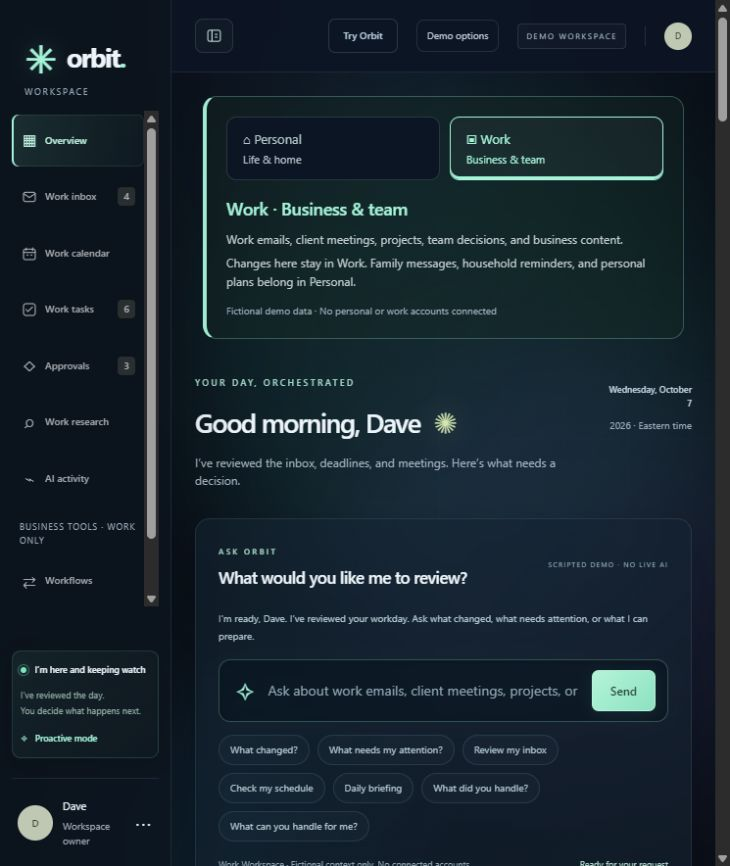

# Orbit — employer demo

A review-first Executive Assistant prototype with separate Personal and Work contexts, plus Work-only campaign tools. Built with AI coding assistance. This demo showcases workflow engineering, not a connected production AI service.

**Quick access:** [Download the source ZIP](https://github.com/david08107-beep/automation-portfolio/archive/refs/heads/main.zip) · [View the repository](https://github.com/david08107-beep/automation-portfolio)

**Portfolio status:** active development with a runnable local demonstration. The current review-first workflow is evaluable now; production hosting and connected integrations remain separate future decisions.

The repository links above reflect the last published `main` branch. Review and publish any newer local changes before presenting them as current.

## Preview without installing anything

The main interface brings briefings, messages, calendar items, tasks, and decisions together. Personal is for life and home; Work is for business and team activity.

[Personal screenshot](screenshots/orbit-personal.png) · [Work screenshot](screenshots/orbit-work.png)

The screenshots show the current professional theme system: overview and Work use Light mode, while Personal also demonstrates Dark mode. They were captured from the working local application with fictional data.

## Run the interactive demo

Requires Node.js 20 or newer. No account, API key, or dependency installation is required.

1. Use **Download the source ZIP** above and extract it, or clone the repository.
2. Open a terminal in the extracted `shared-agent-operations` folder.
3. Run `npm start`.
4. Open **http://127.0.0.1:4317/** on that same computer.
5. Choose **Try Orbit** for the guided demo. It restores the original executive workspace progress when finished.

Stop the server with Ctrl+C. If port 4317 is already in use, stop the other local preview first. This is a local app: the localhost address cannot be shared with another person.

For a guided engineering explanation, open **http://127.0.0.1:4317/showcase**.
The eight-decision case study covers the problem, experience, provider boundary,
grounding, review safety, reliability, evidence, and viability. It supports the
same persistent Light, Dark, and Auto themes as the working app.

## Three-minute evaluation

1. **Executive Assistant:** run Try Orbit to see a Work briefing, inspect a prepared reply, simulate sending it, and view the separate Personal inbox.
2. **Personal versus Work:** switch using the visible context buttons. Business campaign tools appear only in Work. Personal and Work have separate fictional messages and tasks.
3. **Campaign workflow:** in Work, open Content Studio, enter a fictional campaign brief, and prepare a request. Campaign content is a fixed sample; optional Ollama generation is limited to editable inbox reply drafts.
4. **Review-first safety:** edit a draft, save the new version, and approve that exact version. Unsaved edits and stale approvals cannot authorize execution.
5. **Simulation and recovery:** simulate execution, inspect the receipt, and reload to check saved campaign history. Nothing is sent or posted externally.

Use only fictional inputs. Campaign demo history is saved locally in `local-data/history.json`; executive state and scratch edits use browser storage. These histories are separate, and the app is not a multi-user service.

## Engineering evidence

Run `npm test` for the current regression suite (104 tests passed in the 2026-10-10 review). Run `npm run demo` for the command-line workflow simulation, which reports `externalActions: 0`.

The implementation demonstrates exact-version approval, optimistic concurrency, local edit recovery, restart-safe history, and duplicate-execution prevention. See [verification evidence](VERIFICATION.md) and the [technical README](README.md).

## Honest boundaries

No real email, calendar, social account, or employer data is connected. Optional local and hosted Ollama providers can prepare reply drafts only when explicitly enabled; Scripted remains the default, credentials stay server-side, and nothing is automatically approved or sent. No production authentication or public hosting is included. Original baseline applications are not fully merged; campaign and executive histories remain separate. Browser QA is targeted, not a complete accessibility or security certification.

For a no-install interview, the project owner can screen-share the local app using this walkthrough. A recorded video and public interactive hosting are not included in this package.
